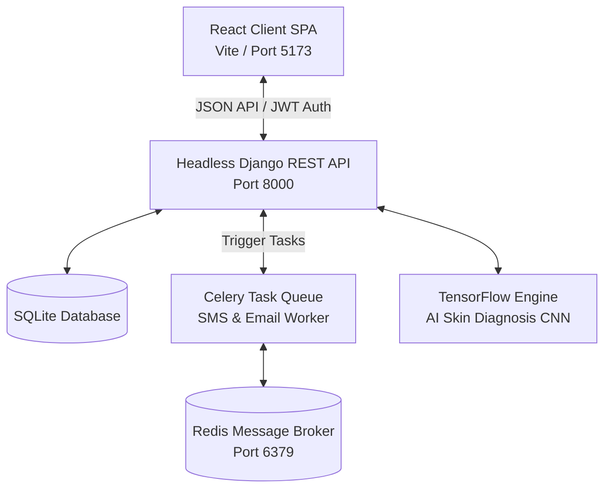

# MediTrack 🩺 — Intelligent Digital Healthcare Portal

MediTrack is a premium, full-featured modern healthcare management platform. The application has been fully migrated from a traditional monolithic structure to a decoupled architecture consisting of a **React Single Page Application (SPA)** frontend and a **Django REST Framework (DRF)** API backend.

---

## 🏗️ System Architecture



---

## ⚡ Core Features

- 🧠 **AI-Based Skin Diagnosis**: Drag-and-drop clinical picture uploader that feeds scans into a convolutional neural network (CNN) model powered by TensorFlow and Keras to return classification scores.
- 📅 **Smart Appointments Booking**: Interactive scheduling calendar with separate dashboards for Doctors (manage consult status) and Patients (book slots).
- 📊 **Health Tracker (BMI/BMR)**: Compute weight, height, BMR, and BMI metrics, saving historical logs displayed in dynamic trend graphs.
- ⏰ **Medication Reminders**: Set prescription alerts with customizable repeat durations, queued in Celery using Redis and delivered via SMS (Twilio) and SMTP email logs.
- 🤝 **Medical Resources (NGOs)**: Verified directory of local healthcare NGOs with search, location filtering, and interactive patient review star-rating submissions.
- 📦 **Equipment Rentals**: Complete rental catalog of wheelchairs, cylinders, and hospital beds with phone dialer desk links and search filtering.

---

## 🛠️ Technology Stack

### Frontend Client
- **Core**: React, Vite
- **Routing**: React Router DOM (v6)
- **Styling**: Vanilla HSL Design System, Glassmorphic panels, Slide-in micro-animations
- **Icons**: Lucide React
- **HTTP Client**: Axios (configured with automated JWT token refresh interceptors)

### Backend REST API
- **Core**: Python, Django, Django REST Framework (DRF)
- **Authentication**: SimpleJWT (JSON Web Tokens)
- **CORS Configuration**: Django CORS Headers (allowing requests from port `5173`)
- **Queue/Broker**: Celery, Redis
- **AI/ML**: TensorFlow, Keras, OpenCV

---

## 🚀 Local Setup & Installation

To run the full suite locally, follow these steps sequentially:

### Step 1: Install and Start Redis Server
MediTrack relies on Redis as a message broker for Celery tasks. You must install and start it on port `6379`.

- **Windows (Docker - Recommended)**:
  Make sure Docker Desktop is installed, then run:
  ```bash
  docker run -d --name redis-meditrack -p 6379:6379 redis
  ```
- **Windows (Native)**:
  Download the Redis `.msi` or `.zip` from the [Github MSOpenTech archive](https://github.com/microsoftarchive/redis/releases), extract it, and run:
  ```powershell
  .\redis-server.exe
  ```
- **macOS (Homebrew)**:
  ```bash
  brew install redis
  brew services start redis
  ```
- **Linux (Ubuntu/Debian)**:
  ```bash
  sudo apt update
  sudo apt install redis-server
  sudo systemctl start redis-server
  ```

---

### Step 2: Set Up Backend API (Django)
1. Open a terminal and navigate to the backend application folder:
   ```bash
   cd mediTrack
   ```
2. Create and configure a Python virtual environment:
   - **Windows**:
     ```powershell
     python -m venv venv
     .\venv\Scripts\activate
     ```
   - **macOS/Linux**:
     ```bash
     python3 -m venv venv
     source venv/bin/activate
     ```
3. Install package dependencies:
   ```bash
   pip install --upgrade pip
   pip install -r requirements.txt
   ```
4. Create a `.env` file inside `mediTrack/` using the following template for keys:
   ```env
   EMAIL_HOST_USER=your_email@gmail.com
   EMAIL_HOST_PASSWORD=your_app_password
   TWILIO_ACCOUNT_SID=your_twilio_sid
   TWILIO_AUTH_TOKEN=your_twilio_token
   TWILIO_PHONE_NUMBER=your_twilio_number
   ```
5. Run migrations to initialize the SQLite database:
   ```bash
   python manage.py migrate
   ```
6. Start the headless API server:
   ```bash
   python manage.py runserver
   ```
The backend API welcome status is served at `http://127.0.0.1:8000/`.

---

### Step 3: Start Celery Worker
1. Open a new terminal and navigate to the backend application folder:
   ```bash
   cd mediTrack
   ```
2. Activate your virtual environment:
   - **Windows**: `.\venv\Scripts\activate`
   - **macOS/Linux**: `source venv/bin/activate`
3. Start the Celery worker process:
   - **Windows (requires threads/solo pool mode)**:
     ```powershell
     celery -A mediTrack worker --loglevel=info -P threads
     ```
   - **macOS/Linux**:
     ```bash
     celery -A mediTrack worker --loglevel=info
     ```
Keep this window open to process asynchronous alerts.

---

### Step 4: Set Up Frontend Client (React)
1. Open a new terminal and navigate to the frontend folder:
   ```bash
   cd frontend
   ```
2. Install client node modules:
   ```bash
   npm install
   ```
3. Start the Vite development server:
   ```bash
   npm run dev
   ```
Open `http://localhost:5173/` in your browser to view the application.

---

## 📬 Contacts & Profile
- **Email**: ay108679@gmail.com
- **GitHub**: [@Anandyadav04](https://github.com/Anandyadav04)
- **LinkedIn**: [Anand Yadav](https://www.linkedin.com/in/anand-yadav-149414356)
